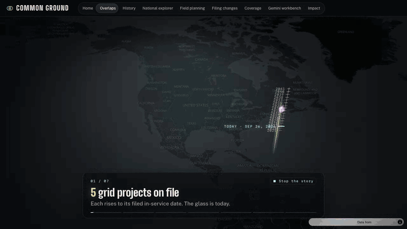
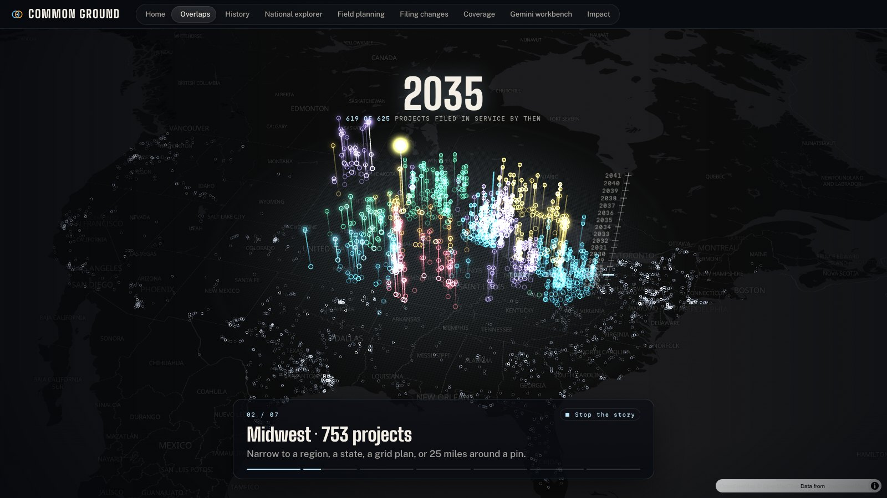
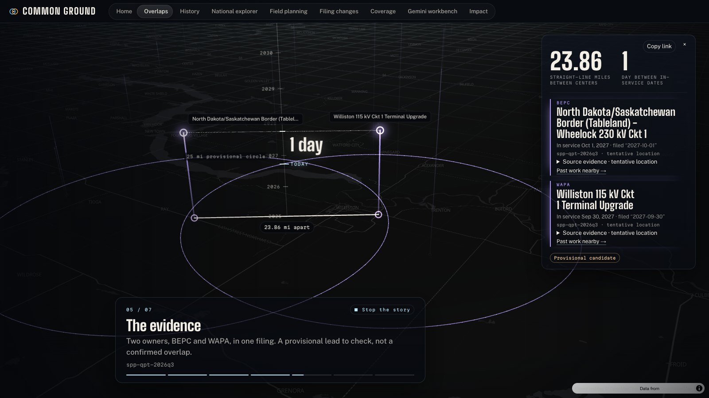
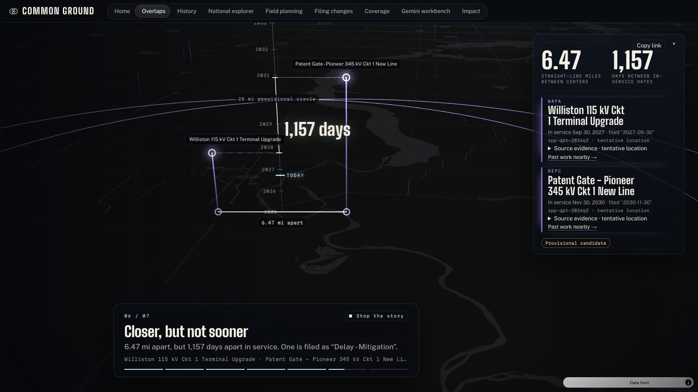
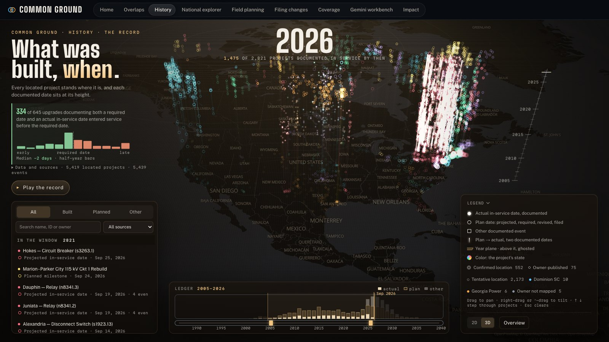
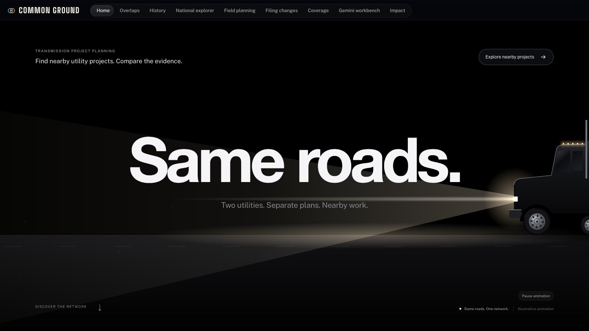

<div align="center">

# Common Ground

**Find the transmission projects being planned next to yours, see when each one is due,<br>and trace every number back to the filing it came from.**

[Live site](https://shellhacks2026-mu.vercel.app) · [Play the 35-second story](https://shellhacks2026-mu.vercel.app/time?story) · [Run it locally](#run-it) · [How we built it](#built-from-specs-by-agents)

<br>



<sub>Every pillar is a planned transmission project. Its height is the date its owner filed for it to enter service.</sub>

</div>

<br>

## The problem

Utilities plan transmission years ahead, and mostly alone. Two projects a few miles apart, owned by different
utilities, get planned, staffed and shipped separately. The crews, cranes and trucks are the same scarce
pool, and they get booked twice. Sperry Tech, the sponsor of this challenge, heard of a contractor quoting
$1.5M of freight on a single $5M job. In 2024, FERC Order No. 1920 reformed long-term regional planning
because of this isolation.

The planning data is public, but it is spread across dozens of filings, spreadsheets and PDFs in different
formats. No one publishes a map that shows whose project sits next to whose, and when each one is due.

Common Ground builds that map. It gives a planner a lead worth a phone call. It doesn't certify compliance
or promise savings.

## What it looks like

The Overlaps view (`/time`) is a 3D map where height is time. Open `/time?story` and it plays a 35-second
film on its own. Every caption in it is built from stored data.

<table>
<tr>
<td width="50%"></td>
<td width="50%"></td>
</tr>
<tr>
<td><b>Narrow the country.</b> Pick a region, a state, a grid plan, or 25 miles around a pin. Everything
outside the scope lies down as a grey trace, and the scope rises in date order.</td>
<td><b>Find the pair to call.</b> Two owners, BEPC and WAPA, filed projects 23.86 miles apart that enter
service one day apart (Sep 30 and Oct 1, 2027). Both come from the same SPP filing.</td>
</tr>
<tr>
<td></td>
<td></td>
</tr>
<tr>
<td><b>Distance isn't timing.</b> The Williston project has a closer neighbor, 6.47 miles away, but that
one is due 1,157 days later and its filing lists it as "Delay - Mitigation". Being close on the ground
only matters if the schedules line up.</td>
<td><b>Check the record.</b> History plots what was actually built, and when. Of 645 upgrades that
document both a required date and an actual one, 334 entered service early. The median was 2 days early.</td>
</tr>
</table>

## The views

| View | What it answers |
|---|---|
| **Overlaps** `/time` | Which planned projects sit within 25 miles of each other, and how far apart are their in-service dates? |
| **History** `/history` | What was built near here, and did it finish on its filed date? |
| **National explorer** `/explore` | Which records did we import, filtered by Census region, state, county, planning region, owner and status? |
| **Field planning** `/operations` | For one worksite: current conditions, a truck-specific route, and records of how similar work actually went. |
| **Filing changes** `/changes` | What changed between two versions of the same filing? 58 fields changed across 31 projects. |
| **Coverage** `/coverage` | How much of each source was extracted, located and reviewed, always with its denominator? |
| **Gemini workbench** `/gemini` | What did Gemini extract from each page, and which fields passed validation against the source? |
| **Impact** `/impact` | What will the weather at this site cost? Ten years of NOAA station records, the NWS forecast, wetland and soil context, and a PDF for the team. |

<p align="center"></p>

## By the numbers

All counts come from the active dataset (`489d9c2`), with an analysis date of Sep 26, 2026.

| Count | What it counts |
|---:|---|
| **3,366** | projects on the Overlaps map, drawn from **142** public sources |
| **2,053** | national projects already in service, which live in History rather than on the planning map |
| **1,352** | national candidate pairs within 25 straight-line miles of each other |
| **17** | of those pairs have an exact date on both sides, so their day gap is known |
| **5,419** | located projects in History, with 5,439 dated events |
| **5** | overlaps within 25 driving miles between Dominion Energy South Carolina and Georgia Power, out of 7,452 cross-utility combinations |
| **15/15** | Gemini coordination briefs that passed validation against their cited facts |

## The rules we don't bend

The sponsor's rules are applied in one canonical matcher. The interface reads its results and never
recomputes them.

- **A project's center** is the mean of its two located endpoints. With one located endpoint, the center
  is that point. With none, the project has no center and is never matched. We don't guess a location.
- **An overlap** needs two different known utilities and a stored driving route of at most 25 miles between
  the two centers. National pairs have no routes stored yet, so they stay labeled *provisional candidates*
  under 25 straight-line miles.
- **The time gap** is the number of days between two exact in-service dates. A month-only or year-only date
  gives no gap. We never pick a day for it.
- **Geography decides an overlap. Time only ranks it.** Pairs under 10 miles come first, then the smaller
  exact gap, then the shorter distance. There's no composite score and no invented probability.
- **The golden test:** the sponsor's worked example (`Projects_Overlaps.xlsx`) must yield exactly its six
  overlaps, OVL_1 to OVL_6, with the same distances and gaps. It runs in CI.

Unknowns stay visible. A location that hasn't been independently reviewed is drawn as a hollow bead. A date
we don't have is listed as missing, not dropped.

## What's not done yet

- **Most national locations are tentative.** Of 3,287 national projects on the map, 46 are independently
  confirmed, 270 use the owner's own coordinates, and 2,971 are tentative matches.
- **Most filed dates aren't exact.** That's why only 17 of 1,352 candidate pairs have a known day gap.
  Florida has 93 candidate pairs and none of them has one.
- **Gemini extraction hasn't run live.** The workbench shows the pipeline and its validation rules, but the
  committed evaluation records zero live calls. The coordination briefs did run live: 15 calls, 15 passed.
- **Candidates are leads, not findings.** No pair here is a confirmed shared construction window.

## Architecture

```text
 Public filings (PDF, XLSX, CSV, HTML)
      │
      ├─► deterministic Python parsers ─────────► versioned JSON ─► JSON Schema validation
      ├─► cached OpenStreetMap inventory ───────► reviewed location evidence      │
      └─► Gemini batch extraction (quote-checked) ───────────────────────────────┤
                                                                                  ▼
                                               GitHub load action (the only Atlas writer)
                                                                                  │
                                                                                  ▼
                              MongoDB Atlas: versioned datasets, GeoJSON centers, 2dsphere index,
                                             an active-dataset pointer switched after a full load
                                                                                  │ read-only
                                                                                  ▼
                                  Next.js route handlers ─► MapLibre + Three.js views, CSV/PDF export
```

- **Web:** Next.js 16, React 19, MapLibre GL 6, and Three.js drawn as a custom MapLibre layer, so the
  pillars share the map's camera.
- **Data:** Python 3.12 with `uv`, one canonical matcher, and JSON Schemas for every artifact.
- **Database:** MongoDB Atlas. Viewport queries use `$geoWithin` on a `2dsphere` index. A dataset only
  goes live after every collection in it has loaded.
- **AI:** Gemini for structured extraction and for coordination briefs. Every response is validated against
  a schema. An extracted field is accepted only if its quote appears on the cited page, and a brief may only
  cite the stored facts it was given.

## Built from specs, by agents

This repository was built in about 31 hours by autonomous coding agents (Claude Code and Codex) working in
parallel from written specs. The spec is the source of truth:

- [`specs/mission.md`](specs/mission.md) says what the product is and which rules it can't break.
- [`specs/roadmap.md`](specs/roadmap.md) assigns **46 features** to agents and gives each one the paths it owns.
- [`specs/decisions/`](specs/decisions) holds **135 decision records**: what was chosen, what was rejected,
  and why.
- Each feature is built in its own worktree and claimed with a draft pull request. CI rejects any change
  outside the paths that feature owns. **259 pull requests** were merged this way.

Humans set the direction, reviewed the output and made the calls. The agents wrote the code, the tests and
the decision records.

## Run it

**Web app** (Node 24):

```bash
cd web
npm ci
DATA_MODE=fixture npm run dev     # the sponsor's sample data, no database needed
```

Fixture mode is labeled as sample data on every page, and production never falls back to it. To read the
real data, set `MONGODB_URI_RO` (and optionally `MONGODB_DB`, default `gridbridge`) and leave `DATA_MODE`
unset. If the database can't be reached, the app says so instead of showing fixtures.

Open `http://localhost:3000/time?story` to watch the film.

**Data pipeline** (Python 3.12, `uv`):

```bash
cd pipeline
uv sync --locked
uv run python -m extract_desc     # Dominion Energy South Carolina filings
uv run python -m extract_gpc      # Georgia planning tables
uv run python -m osm              # cached OpenStreetMap substations
```

Live Gemini extraction needs the explicit `--live` flag plus `GEMINI_API_KEY` and `GEMINI_MODEL`. Without
it, `uv run python -m gemini_extract` makes no calls.

**Checks:**

```bash
(cd pipeline && uv run ruff check . && uv run pytest -q)
(cd web && npm run lint && npm run typecheck && DATA_MODE=fixture npm run build)
```

## Repository

| Path | What's in it |
|---|---|
| `web/` | The Next.js app: pages, route handlers, map views |
| `pipeline/` | Parsers, the canonical matcher, the Atlas loader, Gemini extraction and briefs |
| `data/` | Committed, versioned outputs, each traceable to its source |
| `schemas/` | JSON Schemas every artifact is validated against |
| `specs/` | Mission, roadmap, feature specs and decision records |
| `release/` | Deployment verification ([deploys](release/deploys.md), [judge readiness](release/judge-readiness.md)) |
| `docs/` | The sponsor's original materials (read-only) |

<br>

<div align="center">
<sub>Built at ShellHacks 2026 for Sperry Tech's <i>Gridlock</i> challenge, with the MLH Gemini API and MongoDB Atlas tracks.<br>The repository's working name is GridBridge.</sub>
</div>
